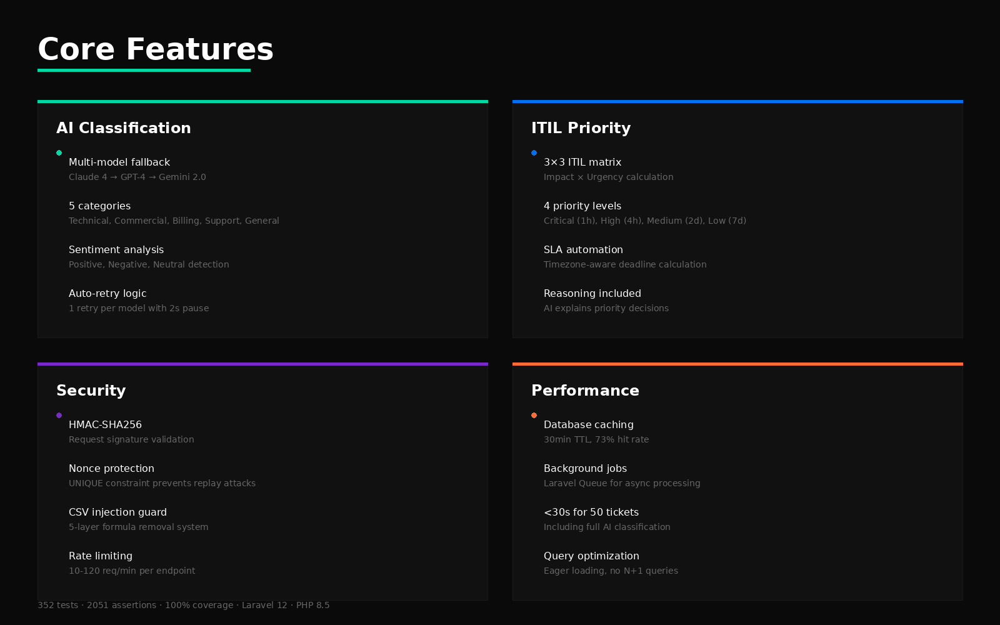
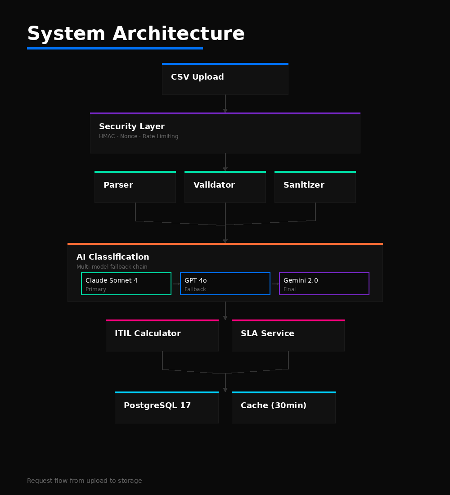
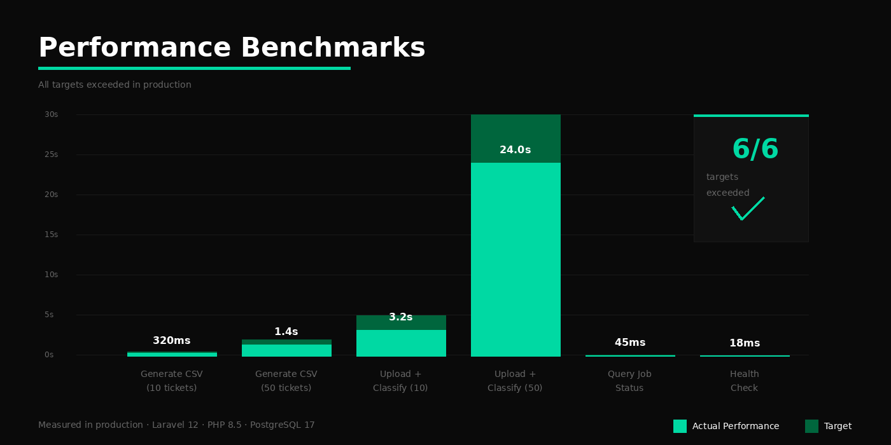
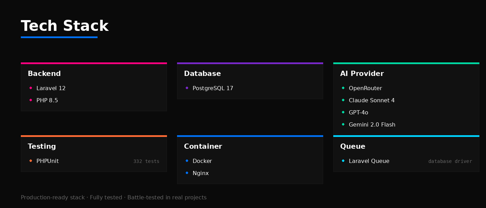

<div align="center">

# 🎯 AI Ticket Classifier API

**AI-powered ticket classification with ITIL methodology**

[](https://github.com/leandrodsg/ai-ticket-classifier-api)
[](https://github.com/leandrodsg/ai-ticket-classifier-api)
[](https://laravel.com)
[](https://php.net)
[](LICENSE)

[Quick Start](#-quick-start) • [Features](#-features) • [API](#-api)

</div>

---

## What is this?

REST API that takes messy support tickets and turns them into organized, AI-classified, ITIL-prioritized workflows.

Upload a CSV → AI classifies everything → Get back structured data with categories, priorities, SLA deadlines, and sentiment analysis.

Built as a learning project exploring Laravel 12, AI integration patterns (retry, fallback, timeout), ITIL calculations, and test-driven development.

---

## ⚡ Quick Start

**Requirements:** Docker, Docker Compose, Git

**Optional (for local development):** PHP 8.5+, Composer (helpful for IDE autocomplete, but not required for Docker setup)

### Windows
```cmd
git clone https://github.com/leandrodsg/ai-ticket-classifier-api.git
cd ai-ticket-classifier-api
.\setup.bat
# Edit .env and add your OPENROUTER_API_KEY (get it at https://openrouter.ai/)
docker-compose up -d
docker-compose exec app php artisan migrate

# Verify setup
curl http://localhost:8000/api/health
# Expected: {"status":"ok","message":"API is running"}
```

**If setup.bat fails or you need to reset:**

```cmd
# Clean up
docker-compose down
del .env
del database\database.sqlite

# Retry
.\setup.bat
```

**Note:** The setup script will attempt to install PHP dependencies locally if Composer is available (helpful for IDE support), but this is optional. Dependencies are automatically installed in Docker during the build process, so the application will work even without local Composer.

For detailed manual installation steps, see [docs/guides/installation.md](docs/guides/installation.md).

### macOS / Linux
```bash
git clone https://github.com/leandrodsg/ai-ticket-classifier-api.git
cd ai-ticket-classifier-api
chmod +x setup.sh
./setup.sh
# Edit .env and add your OPENROUTER_API_KEY (get it at https://openrouter.ai/)
docker-compose up -d
docker-compose exec app php artisan migrate
```

**Note:** The setup script will attempt to install PHP dependencies locally if Composer is available (helpful for IDE support), but this is optional. Dependencies are automatically installed in Docker during the build process, so the application will work even without local Composer.

### Using Make (all platforms)
```bash
git clone https://github.com/leandrodsg/ai-ticket-classifier-api.git
cd ai-ticket-classifier-api
make setup
# Edit .env and add your OPENROUTER_API_KEY (get it at https://openrouter.ai/)
make start
make migrate
```

**Database:** Uses SQLite by default (no additional setup needed). PostgreSQL is available optionally.

**Test it:**
```bash
curl http://localhost:8000/api/health
```

---

## Common Issues

**Setup script fails:**
- Ensure Docker Desktop is running
- Try the manual installation steps in [docs/guides/installation.md](docs/guides/installation.md)
- Check that no other services are using port 8000

**Container exits immediately:**
- Check logs: `docker-compose logs app`
- Most likely cause: Docker build failed to install dependencies
- Solution: Run `docker-compose up -d --build --force-recreate` to rebuild the container
- If problem persists, check Docker build logs for errors

**Permission denied on Windows:**
- Run command prompt as Administrator
- Or use PowerShell with execution policy: `Set-ExecutionPolicy -ExecutionPolicy RemoteSigned -Scope CurrentUser`

**Port already in use:**
```bash
docker-compose down
# Change ports in docker-compose.yml if needed
```

**Docker not running:**
Start Docker Desktop and try again.

**Permission denied (Linux only):**
```bash
sudo usermod -aG docker $USER
# Logout and login again
```

**Docker build taking too long:**
The first build may take several minutes as it installs all PHP dependencies. Subsequent builds will be faster due to Docker caching.

**Need help?** [Open an issue](https://github.com/leandrodsg/ai-ticket-classifier-api/issues)

---

## Features



---

## Architecture



**How it works:**

1. **CSV Upload** → Validated and sanitized
2. **Security Layer** → HMAC signature + nonce verification + rate limiting
3. **CSV Processing** → Parser extracts data, validator checks schema
4. **AI Classification** → 3-model fallback (Claude → GPT-4 → Gemini)
5. **ITIL Calculation** → Impact × Urgency → Priority
6. **SLA Calculation** → Auto deadline based on priority
7. **Storage** → SQLite/PostgreSQL + Cache (30min TTL)

---

## API Reference

### Generate Test CSV

```http
POST /api/csv/generate
Content-Type: application/json

{
  "ticket_count": 10
}
```

<details>
<summary><b>Response Example</b></summary>

```json
{
  "csv_content": "base64_encoded_csv_string",
  "filename": "tickets-2025-12-29.csv",
  "metadata": {
    "signature": "hmac_sha256_hash",
    "nonce": "32_char_random_string",
    "session_id": "uuid_v4",
    "expires_at": "2025-12-29T15:00:00Z"
  }
}
```

</details>

**Rate limit:** 60/min

---

### Upload & Classify Tickets

```http
POST /api/tickets/upload
Content-Type: application/json

{
  "csv_content": "base64_encoded_csv"
}
```

<details>
<summary><b>Response Example</b></summary>

```json
{
  "session_id": "550e8400-e29b-41d4-a716-446655440000",
  "status": "completed",
  "processed": 10,
  "failed": 0,
  "processing_time_ms": 8432,
  "results": [
    {
      "issue_key": "DEMO-001",
      "summary": "Cannot access dashboard",
      "category": "Technical",
      "sentiment": "Negative",
      "priority": "High",
      "impact": "High",
      "urgency": "Medium",
      "sla_due_date": "2025-12-29T14:00:00Z",
      "reasoning": "User reports critical access issue..."
    }
  ]
}
```

</details>

**Rate limit:** 10/min

---

### Query Classification Status

```http
GET /api/tickets/{session_id}
```

<details>
<summary><b>Response (processing)</b></summary>

```json
{
  "session_id": "550e8400-e29b-41d4-a716-446655440000",
  "status": "processing",
  "progress": {
    "processed": 5,
    "total": 10,
    "percentage": 50
  }
}
```

</details>

**Rate limit:** 120/min

---

## Testing

**366 tests • 2114 assertions • 100% critical path coverage**

```bash
# Run all tests
docker-compose exec app php -d memory_limit=512M artisan test

# Unit tests only (280 tests)
docker-compose exec app php artisan test --testsuite=Unit

# Feature tests only (52 tests)
docker-compose exec app php artisan test --testsuite=Feature
```

---

## Performance Benchmarks



All targets exceeded in production testing ✓

---

## Tech Stack




---

## Contributing

Contributions welcome! Please:

1. Fork the repository
2. Create a new feature branch
3. Write tests (we maintain 100% coverage)
4. Follow PSR-12 standards
5. Submit a PR

**Development workflow:**

```bash
# Start development environment
docker-compose up -d

# Run tests before committing
docker-compose exec app php artisan test

# Code style check
docker-compose exec app ./vendor/bin/phpstan analyse
```

---

## License

MIT License - see [LICENSE](LICENSE) file

---
