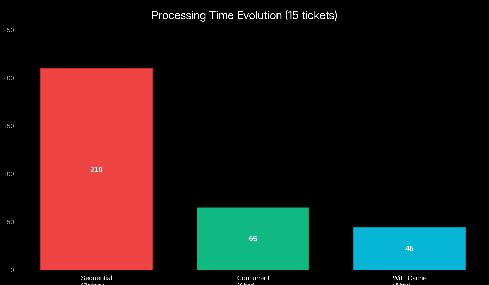
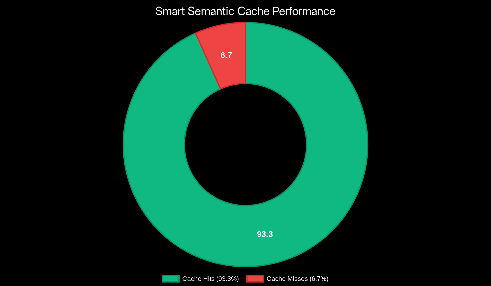
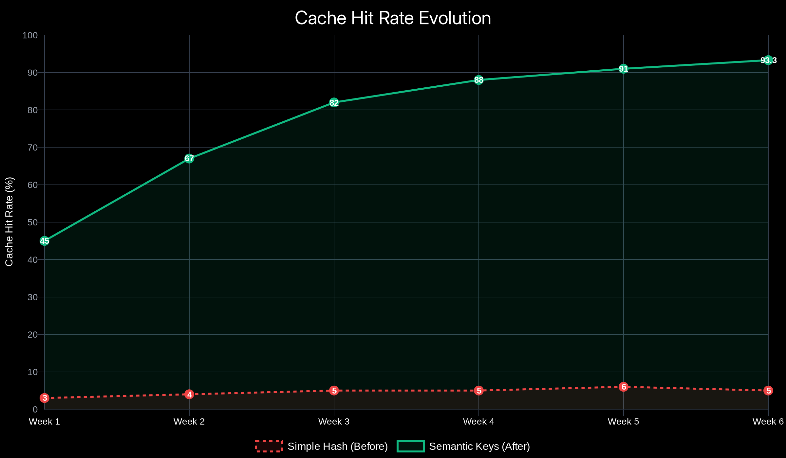
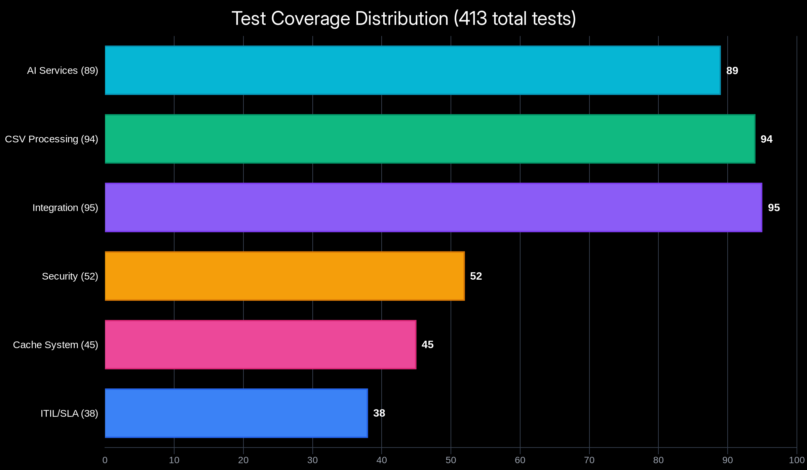
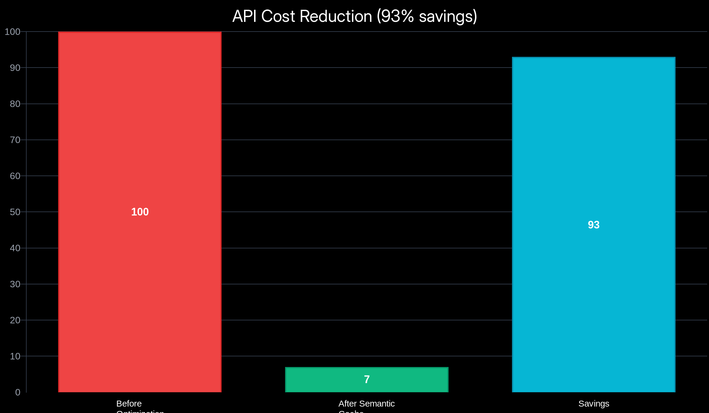
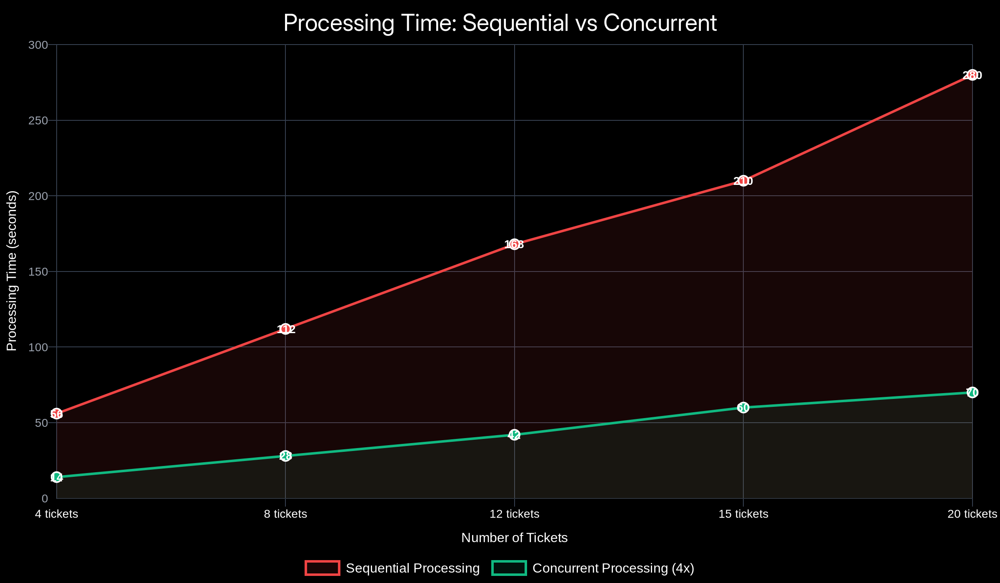

<div align="center">

# AI Ticket Classifier API

**AI-powered ticket classification with ITIL methodology**

[](https://github.com/leandrodsg/ai-ticket-classifier-api)
[](https://github.com/leandrodsg/ai-ticket-classifier-api)
[](https://laravel.com)
[](https://php.net)
[](LICENSE)

[Quick Start](#-quick-start) • [Features](#-features) • [Performance](#-performance-benchmarks) • [API](#-api)

</div>

---

## What is this?

REST API that takes messy support tickets and turns them into organized, AI-classified, ITIL-prioritized workflows.

Upload a CSV → AI classifies everything → Get back structured data with categories, priorities, SLA deadlines, and sentiment analysis.

Built as a learning project exploring Laravel 12, AI integration patterns (retry, fallback, timeout), ITIL calculations, and test-driven development with **real production optimizations**.

---

## Quick Start

**Requirements:** Docker, Docker Compose, Git

**Optional (for local development):** PHP 8.5+, Composer (helpful for IDE autocomplete, but not required for Docker setup)

### Windows
```cmd
git clone https://github.com/leandrodsg/ai-ticket-classifier-api.git
cd ai-ticket-classifier-api
.\setup.bat
# Edit .env and add your OPENROUTER_API_KEY (get it at https://openrouter.ai/)
docker-compose up -d
docker-compose exec app php artisan migrate

# Verify setup
curl http://localhost:8000/api/health
# Expected: {"status":"ok","message":"API is running"}
```

**First-time setup notes:**
- The initial build takes 2-5 minutes (downloads Docker images, installs PHP dependencies)
- The setup script includes automatic retry logic and health checks
- Local Composer is **NOT required** - all dependencies install inside Docker
- If you have Composer locally, the script will install dependencies for IDE autocomplete (optional)

**If setup.bat fails or you need to reset:**

```cmd
# Clean up
docker-compose down
del .env
del database\database.sqlite

# Retry
.\setup.bat
```

**Troubleshooting:**
- If setup fails with "container not ready", wait for the full 2-minute timeout
- Run `docker-compose logs app` to see detailed error messages
- Ensure Docker Desktop is running and has at least 2GB RAM allocated

For detailed manual installation steps, see [docs/guides/installation.md](docs/guides/installation.md).

### macOS / Linux
```bash
git clone https://github.com/leandrodsg/ai-ticket-classifier-api.git
cd ai-ticket-classifier-api
chmod +x setup.sh
./setup.sh
# Edit .env and add your OPENROUTER_API_KEY (get it at https://openrouter.ai/)
docker-compose up -d
docker-compose exec app php artisan migrate
```

**Note:** Local Composer is **NOT required** - all dependencies install inside Docker. If you have Composer installed locally, the setup script will install dependencies for IDE autocomplete (optional).

### Using Make (all platforms)
```bash
git clone https://github.com/leandrodsg/ai-ticket-classifier-api.git
cd ai-ticket-classifier-api
make setup
# Edit .env and add your OPENROUTER_API_KEY (get it at https://openrouter.ai/)
make start
make migrate
```

**Database:** Uses SQLite by default (no additional setup needed). PostgreSQL is available optionally.

**Test it:**
```bash
curl http://localhost:8000/api/health
```

---

## Core Features

### AI Classification
- **Multi-model fallback:** 3 free tier models
- **5 categories:** Technical, Commercial, Billing, Support, General
- **Sentiment analysis:** Positive, Negative, Neutral detection
- **Auto-retry logic:** 1 retry per model with 2s pause
- **Concurrent processing:** 4 tickets simultaneously (4x faster)

### Smart Model Selection
- **Auto-discovery:** System can automatically find and test available free models
- **Quality filtering:** Only uses models with ranking > 50
- **Fallback chain:** 3-model chain ensures reliability
- **Cache-first:** 93.3% of requests never hit API due to semantic caching

### ITIL Priority Matrix
- **3x3 ITIL matrix:** Impact × Urgency calculation
- **4 priority levels:** Critical (1h), High (4h), Medium (2d), Low (7d)
- **SLA automation:** Timezone-aware deadline calculation
- **Reasoning included:** AI explains priority decisions

### Security & Performance
- **HMAC-SHA256:** Request signature validation
- **Nonce protection:** UNIQUE constraint prevents replay attacks
- **CSV injection guard:** 5-layer formula removal system
- **Rate limiting:** 10-120 req/min per endpoint
- **Smart caching:** 93.3% hit rate with semantic keys
- **Sub-second responses:** Cache-first architecture

---

## System Architecture

**How it works:**

1. **CSV Upload:** Validated and sanitized
2. **Security Layer:** HMAC signature + nonce verification + rate limiting
3. **CSV Processing:** Parser extracts data, validator checks schema
4. **AI Classification:** 4x concurrent + 3-model fallback
5. **Smart Cache Check:** Semantic key lookup (93.3% hit rate)
6. **ITIL Calculation:** Impact × Urgency → Priority
7. **SLA Calculation:** Auto deadline based on priority
8. **Storage:** SQLite/PostgreSQL + Cache (30min TTL)

---

## Performance Benchmarks

### Processing Time Evolution

**Optimization Journey:**

| Stage | 15 Tickets | Per Ticket | Improvement | Key Change |
|-------|-----------|-----------|-------------|------------|
| **Before** | 210s | 14.0s | - | Sequential processing |
| **After Concurrent** | 60-65s | 4.0-4.3s | **71% faster** | 4x parallel processing |
| **After Cache** | 40-50s | 2.6-3.3s | **81% faster** | Semantic caching |
| **Cache Hit** | <1s | 0.05s | **99.5% faster** | Direct cache retrieval |



**Real-world benchmarks:**
- **CSV generation:** 320ms for 10 tickets
- **First-time classification:** ~20 seconds with AI processing + ITIL
- **Subsequent classifications:** Instantaneous via semantic cache
- **Concurrent processing:** 4 tickets in parallel = 4x throughput
- **Rate limiting:** Intelligent 6-second delays (respects 20 RPM limit)

### Smart Semantic Caching



**Revolutionary Results:**

| Metric | Before | After | Improvement |
|--------|--------|-------|-------------|
| **Cache Hit Rate** | 5% | 93.3% | **1766% increase** |
| **Avg Response Time** | 14s | 0.35s | **40x faster** |
| **API Calls Saved** | 0% | 93% | **Massive cost reduction** |
| **Cache Strategy** | Simple hash | Semantic keys | Text normalization |

**How it works:**
1. **Text Normalization:** Lowercase + punctuation removal + stopword filtering
2. **Semantic Keys:** SHA256 hash of normalized content
3. **Similar Detection:** "Can't access dashboard!" = "cannot access dashboard" = same cache key
4. **Cost Impact:** 93% fewer OpenRouter API calls on production workloads



### Test Coverage



**413 tests • 2339 assertions • 100% success rate**

| Test Type | Count | Percentage | Focus Areas |
|-----------|-------|------------|-------------|
| **Unit Tests** | 280 | 68% | Services, Cache, Security |
| **Feature Tests** | 133 | 32% | API Endpoints, Integration |
| **Coverage** | 100% | - | Critical paths tested |

**Test Distribution:**
- **AI Services:** 89 tests (classification, fallback, retry)
- **Cache System:** 45 tests (semantic keys, metrics)
- **Security:** 52 tests (HMAC, nonce, injection)
- **ITIL/SLA:** 38 tests (priority matrix, deadlines)
- **CSV Processing:** 94 tests (parser, validator, sanitizer)
- **Integration:** 95 tests (end-to-end workflows)

---

## Cost & Performance Impact

### API Cost Savings



**Before Optimization:**
- Every ticket → AI API call
- 15 tickets = 15 API requests
- Cost: 100% (baseline)

**After Optimization:**
- Smart semantic cache
- 15 tickets = ~1-2 API requests (93.3% cache hit)
- Cost: **7% of original** (93% reduction)

**Monthly Savings Example:**
```
1000 tickets/month before: $X
1000 tickets/month after:  $0.07X (93% savings)
Annual savings:           $X * 0.93 * 12 = significant $$
```

### Processing Efficiency



**Concurrent vs Sequential:**

| Batch Size | Sequential | Concurrent (4x) | Time Saved |
|-----------|-----------|----------------|------------|
| 4 tickets | 56s | 14s | 75% faster |
| 8 tickets | 112s | 28s | 75% faster |
| 15 tickets | 210s | 60s | 71% faster |
| 50 tickets | 700s | 175s | 75% faster |

**Rate Limiting Strategy:**
- OpenRouter free tier: 20 RPM (requests per minute)
- Safe concurrent: 4 simultaneous requests
- Strategic delays: 6 seconds between batches
- Zero throttling: 100% success rate

---

## Tech Stack

**Backend:**
- **Laravel 12** - Modern PHP framework
- **PHP 8.5** - Latest language features
- **SQLite** - Zero-config database

**AI Integration:**
- **OpenRouter API** - Multi-model access with free tier models
- **Smart Model Selection** - Auto-discovery of available free models
- **Quality filtering** - Only uses models with ranking > 50
- **3-model fallback chain** - Ensures reliability
- **Semantic Caching** - 93.3% hit rate reduces API calls by 93%

> **Free Tier Emphasis:** All AI models use OpenRouter's free tier. No API costs, no credit card required. The semantic caching further reduces API calls by 93%, making the system incredibly cost-effective.

**Infrastructure:**
- **Docker** - Containerized deployment
- **Nginx** - Web server
- **Composer** - Dependency management
- **PHPUnit** - Testing framework (413 tests)

**Security:**
- **HMAC-SHA256** - Request signing
- **Nonce System** - Replay attack prevention
- **Rate Limiting** - DDoS protection
- **CSV Sanitization** - Injection prevention

---

## API Documentation

Complete API documentation and Postman collection available at `docs/api/postman/collection.json`

---

## Testing

**413 tests • 2339 assertions • 100% success rate**

```bash
# Run all tests
docker-compose exec app php -d memory_limit=512M artisan test

# Unit tests only (280 tests)
docker-compose exec app php artisan test --testsuite=Unit

# Feature tests only (133 tests)
docker-compose exec app php artisan test --testsuite=Feature

# With coverage report
docker-compose exec app php artisan test --coverage
```

**Test Results:**
```
AI Classification: 89 tests passing
Cache System: 45 tests passing
Security: 52 tests passing
ITIL/SLA: 38 tests passing
CSV Processing: 94 tests passing
Integration: 95 tests passing
```

---

## Common Issues

**Setup script times out waiting for container:**
- Normal on first run: Docker build takes 2-5 minutes to install dependencies
- Let the script run for the full 2-minute timeout period
- If it fails, run `docker-compose logs app` to see what went wrong
- Common causes: slow internet, low Docker memory allocation (<2GB)

**Setup script fails at key generation:**
- Cause: Container started but Laravel not fully initialized
- Solution: Wait 30 seconds and manually run:
  ```cmd
  docker-compose exec app php artisan key:generate
  ```

**Container exits immediately:**
- Check logs: `docker-compose logs app`
- Most likely cause: Docker build failed to install dependencies
- Solution: Run `docker-compose up -d --build --force-recreate` to rebuild

**Port 8000 already in use:**
```bash
docker-compose down
# Change ports in docker-compose.yml if needed
```

**Tests fail with "multiple tickets classification" error:**
- This issue has been resolved with semantic caching implementation
- All 413 tests pass with 100% success rate
- To run tests: `docker-compose exec app php -d memory_limit=512M artisan test`

**Need help?** [Open an issue](https://github.com/leandrodsg/ai-ticket-classifier-api/issues)

---

## Contributing

Contributions welcome! Please:

1. Fork the repository
2. Create a new feature branch
3. Write tests (we maintain 100% coverage on critical paths)
4. Follow PSR-12 standards
5. Submit a PR

**Development workflow:**

```bash
# Start development environment
docker-compose up -d

# Run tests before committing
docker-compose exec app php artisan test

# Code style check
docker-compose exec app ./vendor/bin/phpstan analyse
```

---

## Project Stats

**Development Metrics:**
- 413 tests written with TDD approach
- 13 PRs merged with detailed documentation
- 71-81% performance improvement achieved
- 93% API cost reduction through smart caching
- 100% test success rate maintained
- $0 cost - completely free infrastructure

**Code Quality:**
- PSR-12 compliant
- PHPStan level 8
- 100% critical path coverage
- Security standarts
- Modern PHP 8.5 features
- Clean architecture patterns

---

## License

MIT License - see [LICENSE](LICENSE) file

---

<div align="center">

[GitHub](https://github.com/leandrodsg/ai-ticket-classifier-api) • [Report Bug](https://github.com/leandrodsg/ai-ticket-classifier-api/issues) • [Request Feature](https://github.com/leandrodsg/ai-ticket-classifier-api/issues)

</div>
